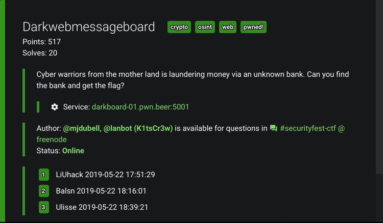
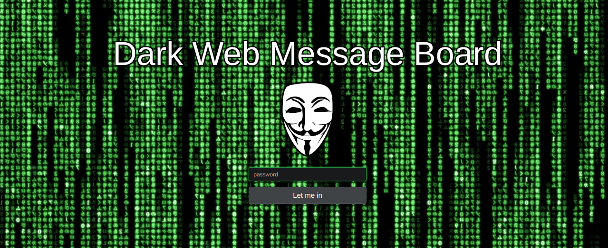
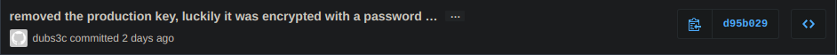
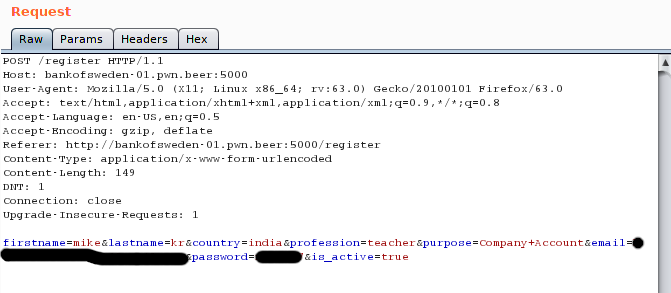
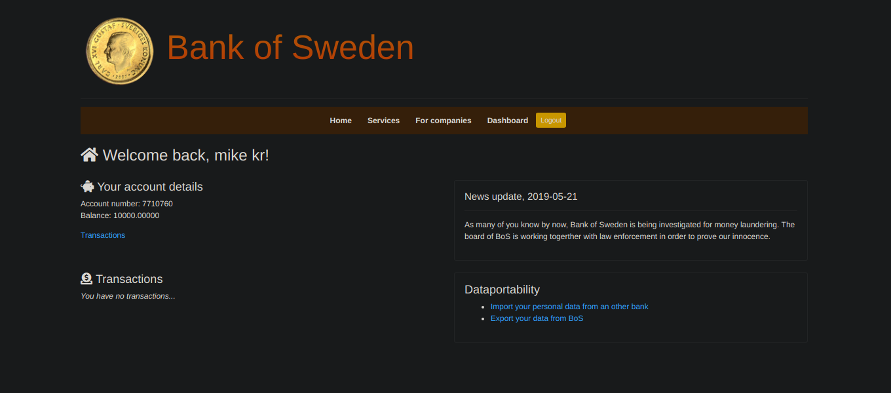
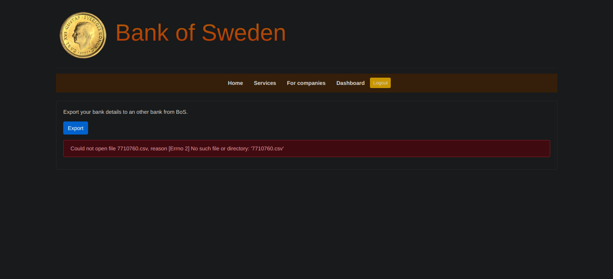
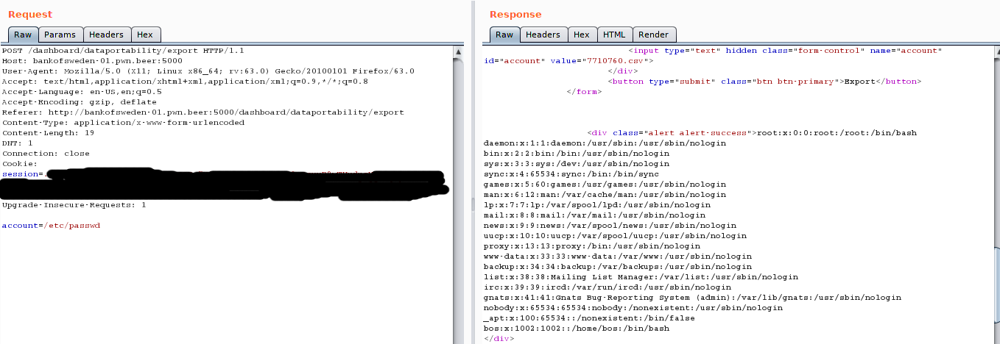
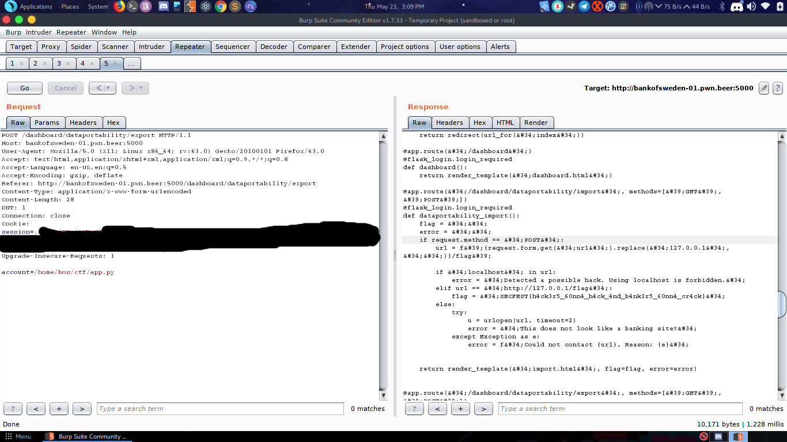

# Darkwebmessageboard 

## Category:
### OSINT , Crypto , Web
That's a lot of categories boy.

## Difficulty:
### It was pretty difficult

## Writeup:
### DISCLAIMER : This is going to be super LONG.....
This chall looked interesting because of its three different categories. So I completed the three parts one by one.
### First Phase: OSINT
The url http://darkboard-01.pwn.beer:5001 gave a page

a cool one with a password form. So I viewed the source and found the string :
> | Dark Web Message Board | DEVELOPED BY K1tsCr3w | Open source at Kits-AB 

which was commented out. Open Source gave a hint to github. So I searched in github for the user Kits-AB and got the source for the website. https://github.com/kits-ab/the-dark-message-board. Checking the directories, **robots.txt** caught my eye. It had an entry __/boards/*__. Opening http://darkboard-01.pwn.beer:5001/boards/1 gave a message board which contained lot of messages. The one which was of importance was :
```
rW+fOddzrtdP7ufLj9KTQa9W8T9JhEj7a2AITFA4a2UbeEAtV/ocxB/t4ikLCMsThUXXWz+UFnyXzgLgD9RM+2toOvWRiJPBM2ASjobT+bLLi31F2M3jPfqYK1L9NCSMcmpVGs+OZZhzJmTbfHLdUcDzDwdZcjKcGbwEGlL6Z7+CbHD7RvoJk7Ft3wvFZ7PWIUHPneVAsAglOalJQCyWKtkksy9oUdDfCL9yvLDV4H4HoXGfQwUbLJL4Qx4hXHh3fHDoplTqYdkhi/5E4l6HO0Qh/jmkNLuwUyhcZVnFMet1vK07ePAuu7kkMe6iZ8FNtmluFlLnrlQXrE74Z2vHbQ==
```
It was encrypted with something. Getting back to git repo, the tests dir had a test_crypto.py (this file was of super importance). Since it was OSINT the repo had 3 commits. So I looked the commit history which had this fishy commit which was deleted.

 So i viewed it and it had a __PRIVATE_KEY__ (which was to be used later) and a description:
 ```
 removed the production key, luckily it was encrypted with a password …

…from some file that reminds me of the song 'here i am something like a hurricane'
```
The song in the description was __Rock_You_Like_a_Hurricane__ , so with this I concluded that somehow rockyou.txt was involved in the chall. And this ends our OSINT phase.

### Second Phase: Crypto
Now comes the file __test_crypto.py__. Understanding the file, the script carries out random generation of private keys on top of a password and a PADDING... (Boy oh Boy that much Security).So this was the script in a nutshell, with this we needed to find a password from rockyou.txt to decrypt the text obtained from __/boards/1__ . So i modified the test_crypto.py to accomplish this. Here's my modified decryption function.
```python
with open("rockyou.txt", errors='replace') as f:
    r = f.readlines()
    p_list = [i.strip() for i in r]
for l in p_list:
    try:
        private_key =      
        serialization.load_pem_private_key(
                    PEM_PRIVATE_KEY,
                    password=bytes(l, 'utf-8'),
                    backend=default_backend() )
                    
        plaintext = private_key.decrypt(
    base64.b64decode(ENCRYPTED_MESSAGE.encode('utf-8')),DEFAULT_PADDING)
        print(plaintext)
    except:
        continue
```
I looped thorugh all the pwds from rockyou to get a hit
and replaced the PRIVATE_KEY with the one given in github deleted commit and waited for the decrypted text to appear. The heavy load nearly crashed my box. The decrypted text was a URL for our next phase.
>Bank url: http://bankofsweden-01.pwn.beer

This marked the end for our Crypto Phase.

### Third Phase: Web 
Now the last and the longest phase. Opening the URL obtained got me nowhere. So the chall desription had this :
```
You will find a URL. If it says https://XXXXXXXXX/, change it to http://XXXXXXXXX:5000/
```
So our modified URL changed to http://bankofsweden-01.pwn.beer:5000 

It directed us to the BANK website which the chall had in its description. It had a Login and Registration form. I registered with some creds but for some reason the account did'nt seem to activate. So while registering, I captured the request with Burp-Suite.
It had an __is_active__ param. Setting it to true did the trick to activate our account.

Logging in gave us a Greeting msg (Nice site)

Exploring the site, it had two features IMPORT and EXPORT. I first used the export feature

When I clicked the export btn It tried to open a file which wasn't present in the dir. So It was a bit suspicious. So I called my frnd BURP again and captured the req. The param account had LFI so I used it to my advantage.

Hahah I got /etc/passwd. Now the real part came. looking for the flag..... It took some time to find the dir and the flag file. Using __/proc/self/environ__
I looked through the env variables and found this:
>PWD=/home/bos/ctf

This was the last lead which I found and it took me a while to figure out that the webapp was FLASKED...(based on flask).
So I looked tried tha app.py inside ctf/
>/home/bos/ctf/app.py


and yeaaa....It worked and the flag was right there.
```
sctf{h4ck3r5_60nn4_h4ck_4nd_b4nk3r5_60nn4_cr4ck}
```
That was the longest chall I ever solved.
Hats off the my team mates:
[nullpxl](https://github.com/nullpxl)
[mrT4ntr4](https://github.com/mrT4ntr4) for helping me with this chall.

Hope u like it.
Team [Dc1ph3R](https://ctftime.org/team/69272).

The full script to the crypto part:
