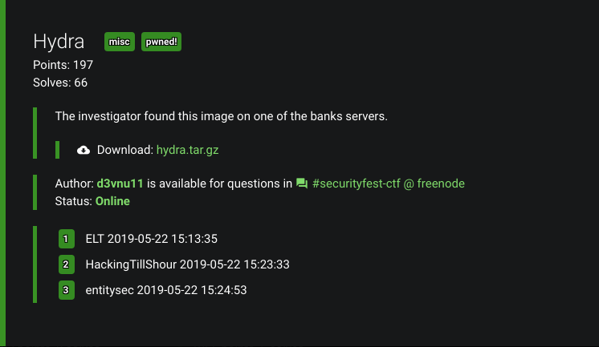
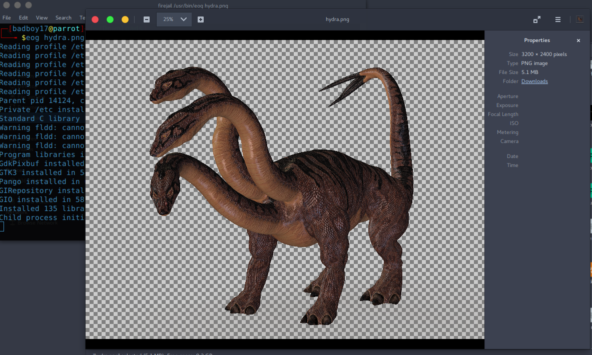
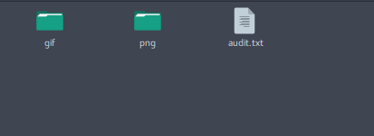
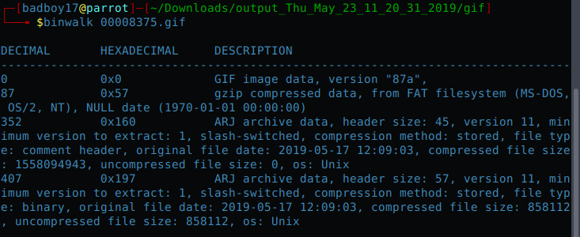
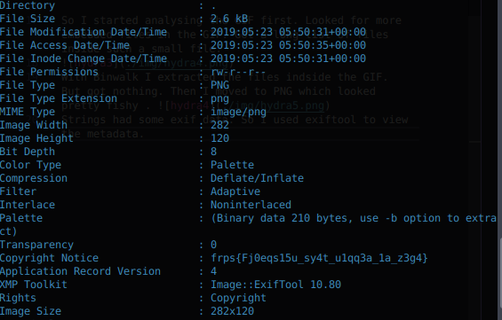

## Hydra (Misc)

## Description:



## Difficulty:
 Not so Ez :P

## Writeup:

Just another chall from another CTF. A png (a big one) was given to start with. 
.
So the first hunch was to look for the embedded data.
I used foremost to extract the data. Got a png and a GIF.                                                   

So I started analysing the GIF first. Looked for more embedded files in the GIF. Got a long list of files inside such a small file.

With Binwalk I extracted the files indside the GIF. But got nothing. Then I moved to PNG which looked pretty fishy . 

Strings had some exif data. So I used exiftool to view the metadata. And Found this rotted string.

```
frps{Fj0eqs15u_sy4t_u1qq3a_1a_z3g4}
```
But this wasn't our flag. So I unrotted it (ROT-13) using :
```
echo "frps{Fj0eqs15u_sy4t_u1qq3a_1a_z3g4}" | tr 'A-Za-z' 'N-ZA-Mn-za-m'
```
Output:
```
secf{Sw0rdf15h_fl4g_h1dd3n_1n_m3t4}
```

That's our Flag();