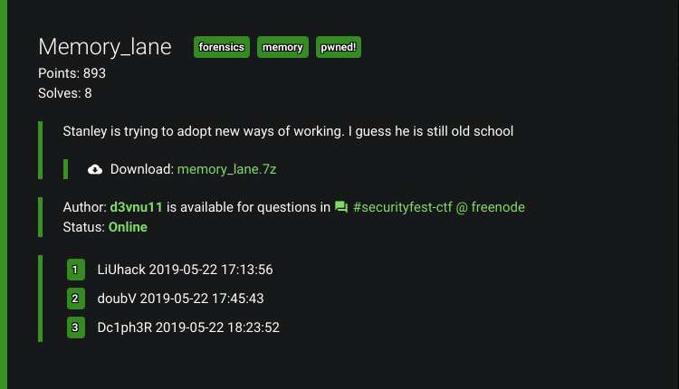
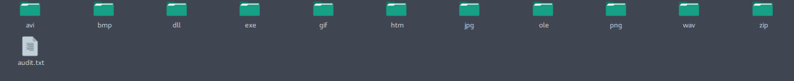
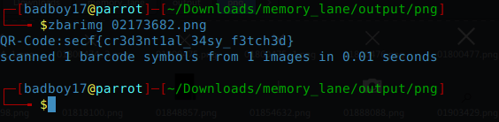

# Memory_lane (Forensics)

## Description:


## Difficulty:
### Medium 

## Writeup:
Our team [Dc1ph3R](https://ctftime.org/team/69272) made into the TOP 3 Pwners of this chall. The file took too much time to download (Slooow Internet). Extracting the 7z gave a vmem image. So a forensics chall with a image. That certainly points to Volatility but this time volatility was not able to identify the profile of the image. So I decided to use foremost and dump all the files of the image. And got a whole bunch of files. 

Now I checked each and every folder for some Juicy content until I reached to png folder. It had several icons and PNGs including two QR-Codes which were same btw. . 

And there it was our flag lying inside a QR-code.
```
secf{cr3d3nt1al_34sy_f3tch3d}
```
